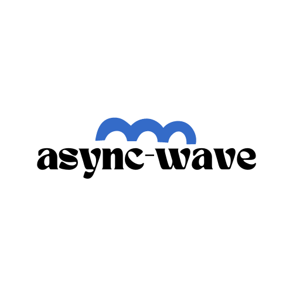

<h1 align="center">
   <b>
      <br>
   </b>
</h1>

<p align="center">`async-wave` is a safely executed asynchronous function that sequentially executes a chain of callback functions and returns the result. It safely transforms any value into a Promise and passes it as an argument to the asynchronous function. This allows for easy management of asynchronous operations and returning of results. Additionally, `asyncWave` provides intuitive implementation of error handling, success handling, and other logic through callback functions. This enables developers to write safe and efficient asynchronous code.</p>

- [🇰🇷 한국어](./README.md)

## Table of Contents

- [Installing](#installing)
  - [Package manager](#package-manager)
  - [CDN](#cdn)
- [Usage](#usage)
- [Example](#example)

## Installing

### Package manager

Using npm:

```bash
$ npm install async-wave
```

Using yarn:

```bash
$ yarn add async-wave
```

### CDN

Using unpkg CDN:

```html
<script src="https://unpkg.com/async-wave@{{VERSION}}/dist/index.js"></script>
```

## Usage

```typescript
import { asyncWave } from 'async-wave';

type GithubUser = { avatar_url: string };

async function loadGithubUser(name: string) {
  return await fetch(`https://api.github.com/users/${name}`);
}

async function loadJson(response: Response): Promise<GithubUser> {
  return await response.json();
}

function showAvatar(githubUser: GithubUser): Promise<GithubUser> {
  return new Promise(function (resolve) {
    const img = document.createElement('img');
    img.src = githubUser.avatar_url;
    img.className = 'promise-avatar-example';
    document.body.append(img);

    setTimeout(() => {
      img.remove();
      resolve(githubUser);
    }, 3000);
  });
}

const USER_NAME = 'jeongbaebang';

async function getAvatarUrlfromGithub(userName: string): Promise<GithubUser> {
  const response = await loadGithubUser(userName);
  const loadedJson = await loadJson(response);

  return loadedJson;
}

// Promises chaining
startLoadingIndicator();
getAvatarUrlfromGithub(USER_NAME)
  .then(showAvatar)
  .then((githubUser) => console.log(`avatar_url: ${githubUser.avatar_url}`))
  .catch((error) => console.error(error))
  .finally(endLoadingIndicator);

// with asyncWave
asyncWave<GithubUser>([USER_NAME, getAvatarUrlfromGithub], {
  onBefore: () => {
    startLoadingIndicator();
  },
  onSuccess: async (githubUser) => {
    await showAvatar(githubUser); // 핸들러 내부 에러도 캐치됩니다!
    console.log(`avatar_url: ${githubUser.avatar_url}`);
  },
  onError: (error) => {
    console.error(error);
  },
  onSettled: () => {
    endLoadingIndicator();
  },
});
```

### Parameters

- startValue (optional): The first value to be promisified. If the value is not a function or a promise, it will be automatically converted into a function that returns a promise.

**Note: If a function is passed as the first argument and its return value is not a promise, an error will be thrown.**

- callbacks: An array of callback functions to be executed in the then method.
- option (optional): An optional object that provides the following callback functions:
  - onError: A function triggered when the promise reaches a rejected state.
  - onSuccess: A function triggered when the promise reaches a resolved state. The result of the last promise is passed as an argument to this function.
  - onSettled: A function triggered when the promise reaches either a resolved or a rejected state.

### Return Value

A Promise object that returns the result of the last promise in the chain.

## Example

With **async-wave**

```typescript
import { asyncWave } from 'async-wave';

// Example 1: Using startVal, callbacks, and option
asyncWave<string, string>(placeId, [getPlaceDetailResult, createAddress], {
  onError: () => {
    return mapErrorHandler(placeId, 'network');
  },
  onSuccess: (data) => {
    console.log('Place details:', data);
    // Store place details in a cache
  },
});

// Example 2: Using only callbacks and option
asyncWave<string[]>([fetchData, processData], {
  onError: handleError,
  onSuccess: handleSuccess,
});
```

## License

[MIT](https://github.com/jeongbaebang/async-wave/blob/main/LICENSE)
