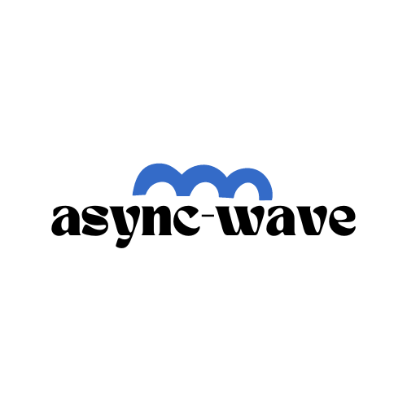

<h1 align="center">
   <b>
      <br>
   </b>
</h1>

<p align="center">"async-wave"는 안전하고 효율적인 비동기 코드 작성을 위해, 콜백 함수를 메서드 체인으로 연결하여 순차적으로 실행하고 처리 결과를 반환하는 비동기 함수입니다. 이를 통해 다양한 비동기 작업을 간편하게 처리할 수 있습니다.</p>

- [🇺🇸 English](./README-US.md)

## Table of Contents

- [Installing](#installing)
  - [Package manager](#package-manager)
  - [CDN](#cdn)
- [Usage](#Usage)

## Installing

### Package manager

Using npm:

```bash
$ npm install async-wave
```

Using yarn:

```bash
$ yarn add async-wave
```

### CDN

Using unpkg CDN:

```html
<script src="https://unpkg.com/async-wave@{{VERSION}}/dist/bundle.js"></script>
```

## Usage

### Before

```ts
// Promises chaining
await setFetchLog();
startLoadingIndicator();
getGithubUser(USER_NAME)
  .then(loadJson)
  .then(showAvatar)
  .then((githubUser) => console.log(`avatar_url: ${githubUser.avatar_url}`))
  .catch((error) => console.error(error))
  .finally(endLoadingIndicator);
```

### After

#### 전통적인 방식 (Traditional API)

```typescript
import { asyncWave } from 'async-wave';

// 첫번째 인수는 어떤 값을 전달하든 항상 프로미스로 감싸져서 전달됩니다.
asyncWave<GithubUser>([USER_NAME, getGithubUser, loadJson], {
  onBefore: async () => {
    await setFetchLog(); // 핸들러 내부 에러도 캐치됩니다! [1]
    startLoadingIndicator();
  },
  onSuccess: async (githubUser) => {
    await showAvatar(githubUser); // 핸들러 내부 에러도 캐치됩니다! [2]
    console.log(`avatar_url: ${githubUser.avatar_url}`);
  },
  onError: (error) => {
    console.error(error);
  },
  onSettled: () => {
    endLoadingIndicator();
  },
});
```

#### 새로운 방식 (Method Chaining API) ✨ NEW!

```typescript
import { asyncWave } from 'async-wave';

// 메서드 체이닝으로 더 직관적이고 간결하게!
asyncWave
  .from(USER_NAME)
  .before(async () => {
    await setFetchLog();
    startLoadingIndicator();
  })
  .then(getGithubUser)
  .then(loadJson)
  .then(async (githubUser) => {
    await showAvatar(githubUser);
    console.log(`avatar_url: ${githubUser.avatar_url}`);
  })
  .catch((error) => console.error(error))
  .finally(() => endLoadingIndicator())
  .execute();
```

#### 더 간단한 예제

```typescript
// Promise처럼 자연스럽게!
const result = await asyncWave
  .from(10)
  .then(x => x + 5)
  .then(x => x * 2)
  .execute();

console.log(result); // 30

// 여러 함수를 한 번에 연결
asyncWave
  .from(initialValue)
  .pipe(fn1, fn2, fn3)
  .onSuccess(result => console.log('Success:', result))
  .onError(error => console.error('Error:', error))
  .execute();
```

## 🚀 고급 기능 (Advanced Features)

async-wave는 실무에서 바로 활용할 수 있는 강력한 기능들을 제공합니다.

### 1. ⏱️ 자동 재시도 (Retry)

네트워크 요청 실패 시 자동으로 재시도합니다.

```typescript
// 일반 재시도: 3번 시도, 1초 간격
await asyncWave
  .from(apiUrl)
  .then(fetchData)
  .retry(3, { delay: 1000 })
  .execute();

// Exponential Backoff: 1s, 2s, 4s, 8s, 최대 10s
await asyncWave
  .from(apiUrl)
  .then(fetchData)
  .retry(5, {
    strategy: 'exponential',
    delay: 1000,
    maxDelay: 10000
  })
  .execute();

// 커스텀 조건: TIMEOUT 에러만 재시도
await asyncWave
  .from(request)
  .then(apiCall)
  .retry(3, {
    shouldRetry: (error) => error.code === 'TIMEOUT'
  })
  .execute();
```

### 2. ⏰ 타임아웃 (Timeout)

느린 작업을 자동으로 중단합니다.

```typescript
import { TimeoutError } from 'async-wave';

await asyncWave
  .from(query)
  .then(searchDatabase)
  .timeout(5000) // 5초 제한
  .catch(err => {
    if (err instanceof TimeoutError) {
      console.log('작업 시간 초과!');
    }
  })
  .execute();
```

### 3. 🔍 디버깅 (Tap & Debug)

각 단계의 값을 확인하면서 개발할 수 있습니다.

```typescript
await asyncWave
  .from(userData)
  .tap(data => console.log('Input:', data)) // 값 확인만, 변경 안 함
  .then(validateUser)
  .debug('After validation') // 자동 로깅
  .then(saveToDatabase)
  .tap(result => sendAnalytics(result))
  .execute();

// 출력:
// Input: { id: 123, name: 'Alice' }
// [AsyncWave Debug] After validation: { id: 123, name: 'Alice', valid: true }
```

### 4. ⏳ 지연 실행 (Delay)

Rate limiting, 폴링 등에 활용합니다.

```typescript
// 2초 후 실행
await asyncWave
  .from(message)
  .delay(2000)
  .then(sendNotification)
  .execute();

// API Rate Limiting
for (const user of users) {
  await asyncWave
    .from(user)
    .then(sendEmail)
    .delay(100) // 100ms 간격
    .execute();
}
```

### 5. 🔀 조건부 실행 (When & Unless)

조건에 따라 함수를 실행합니다.

```typescript
await asyncWave
  .from(user)
  .when(u => u.isPremium, sendPremiumWelcome) // 프리미엄이면 실행
  .unless(u => u.verified, requestVerification) // 미인증이면 실행
  .then(saveUser)
  .execute();

// Boolean 조건도 가능
const isProduction = process.env.NODE_ENV === 'production';

await asyncWave
  .from(data)
  .when(isProduction, uploadToS3)
  .unless(isProduction, saveLocally)
  .execute();
```

### 6. 🛡️ 폴백 (Fallback)

에러 발생 시 기본값을 반환합니다.

```typescript
const user = await asyncWave
  .from(userId)
  .then(fetchUserFromAPI)
  .fallback({ id: 0, name: 'Guest' }) // 실패 시 게스트 반환
  .execute();

// Retry와 함께 사용
const data = await asyncWave
  .from(url)
  .then(fetchData)
  .retry(3)
  .fallback([]) // 3번 시도 후에도 실패하면 빈 배열
  .execute();
```

### 7. ⚡ 병렬 실행 (Parallel)

여러 비동기 작업을 동시에 실행합니다.

```typescript
// 여러 API를 동시에 호출
const [user, posts, comments] = await asyncWave.parallel([
  fetchUser(userId),
  fetchPosts(userId),
  fetchComments(userId)
]);

// 순차 실행 대비 3배 빠름!
```

### 8. 🚫 작업 취소 (Abort)

진행 중인 작업을 취소합니다.

```typescript
import { AbortError } from 'async-wave';

const builder = asyncWave
  .from(query)
  .then(longRunningTask);

const promise = builder.execute();

// 사용자가 취소 버튼 클릭 시
cancelButton.onclick = () => builder.abort();

try {
  await promise;
} catch (err) {
  if (err instanceof AbortError) {
    console.log('사용자가 작업을 취소했습니다');
  }
}
```

### 9. 💾 캐싱 (Cache)

결과를 캐시하여 성능을 향상시킵니다.

```typescript
// 1분간 캐시
const userData = await asyncWave
  .from(userId)
  .then(expensiveAPICall)
  .cache(60000)
  .execute();

// 같은 userId로 재호출 시 캐시된 결과 반환 (API 호출 안 함!)
const cachedData = await asyncWave
  .from(userId)
  .then(expensiveAPICall)
  .cache(60000)
  .execute();

// 커스텀 캐시 키
await asyncWave
  .from({ userId: 123, includeDetails: true })
  .then(fetchUser)
  .cache(60000, {
    key: (data) => `user-${data.userId}`
  })
  .execute();

// 캐시 클리어
asyncWave.clearCache();
```

### 10. 🎯 실전 예제: 모든 기능 조합

```typescript
// 실무에서 바로 쓸 수 있는 강력한 패턴
const result = await asyncWave
  .from(userId)
  .before(async () => {
    showLoadingSpinner();
    await checkAuthentication();
  })
  .delay(300) // Debounce
  .tap(id => analytics.track('user_fetch_started', { id }))
  .then(fetchUserFromAPI)
  .retry(3, { strategy: 'exponential', delay: 1000 })
  .timeout(10000)
  .then(enrichUserData)
  .when(user => user.needsSync, syncWithBackend)
  .tap(user => updateCache(user))
  .cache(300000) // 5분 캐시
  .fallback({ id: 0, name: 'Guest', role: 'visitor' })
  .onSuccess(user => {
    hideLoadingSpinner();
    analytics.track('user_loaded', { userId: user.id });
  })
  .catch(error => {
    hideLoadingSpinner();
    showErrorNotification(error);
    logError(error);
  })
  .finally(() => {
    cleanupResources();
  })
  .execute();
```

### Parameters

- callbacks: then 메서드에서 실행할 콜백 함수들의 배열입니다. (**참고: 첫번째 인수는 어떤 값을 전달하든 항상 프로미스로 감싸져서 전달됩니다.**)
- option (선택 사항): 다음 콜백 함수들을 제공하는 선택적인 객체입니다:
  - onBefore: 프로미스가 시작되기 전에 실행되는 함수입니다. 해당 함수는 async 함수로 전달해야 합니다.
  - onError: 프로미스가 거부된 상태에 도달했을 때 실행되는 함수입니다.
  - onSuccess: 프로미스가 해결된 상태에 도달했을 때 실행되는 함수입니다. 마지막 프로미스의 결과가 이 함수의 인자로 전달됩니다.
  - onSettled: 프로미스가 해결되거나 거부된 상태에 도달했을 때 실행되는 함수입니다.

### Return Value

체인에서 마지막 프로미스의 결과를 반환하는 Promise 객체입니다.
