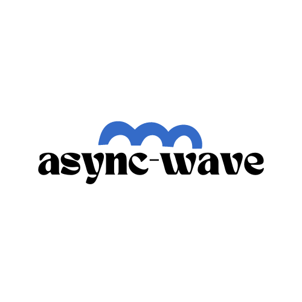

<h1 align="center">
   <b>
      <br>
   </b>
</h1>

<p align="center">"async-wave"는 안전하고 효율적인 비동기 코드 작성을 위해, 콜백 함수를 메서드 체인으로 연결하여 순차적으로 실행하고 처리 결과를 반환하는 비동기 함수입니다. 이를 통해 다양한 비동기 작업을 간편하게 처리할 수 있습니다.</p>

- [🇺🇸 English](./README-US.md)

## Table of Contents

- [Installing](#installing)
  - [Package manager](#package-manager)
  - [CDN](#cdn)
- [Usage](#Usage)
- [Example](#example)

## Installing

### Package manager

Using npm:

```bash
$ npm install async-wave
```

Using yarn:

```bash
$ yarn add async-wave
```

### CDN

Using unpkg CDN:

```html
<script src="https://unpkg.com/async-wave@{{VERSION}}/dist/index.js"></script>
```

## Usage

```typescript
import { asyncWave } from 'async-wave';

type GithubUser = { avatar_url: string };

async function loadGithubUser(name: string) {
  return await fetch(`https://api.github.com/users/${name}`);
}

async function loadJson(response: Response): Promise<GithubUser> {
  return await response.json();
}

function showAvatar(githubUser: GithubUser): Promise<GithubUser> {
  return new Promise(function (resolve) {
    const img = document.createElement('img');
    img.src = githubUser.avatar_url;
    img.className = 'promise-avatar-example';
    document.body.append(img);

    setTimeout(() => {
      img.remove();
      resolve(githubUser);
    }, 3000);
  });
}

const USER_NAME = 'jeongbaebang';

async function getAvatarUrlfromGithub(userName: string): Promise<GithubUser> {
  const response = await loadGithubUser(userName);
  const loadedJson = await loadJson(response);

  return loadedJson;
}

// Promises chaining
startLoadingIndicator();
getAvatarUrlfromGithub(USER_NAME)
  .then(showAvatar)
  .then((githubUser) => console.log(`avatar_url: ${githubUser.avatar_url}`))
  .catch((error) => console.error(error))
  .finally(endLoadingIndicator);

// with asyncWave
startLoadingIndicator();
asyncWave<GithubUser>([USER_NAME, getAvatarUrlfromGithub], {
  onSuccess: async (githubUser) => {
    await showAvatar(githubUser); // 핸들러 내부 에러도 캐치됩니다!
    console.log(`avatar_url: ${githubUser.avatar_url}`);
  },
  onError: (error) => {
    console.error(error);
  },
  onSettled: () => {
    endLoadingIndicator();
  },
});
```

### Parameters

- startValue (선택 사항): 프로미스로 변환될 첫 번째 값입니다. 만약 이 값이 함수나 프로미스가 아닌 경우, 자동으로 프로미스를 반환하는 함수로 변환됩니다. 첫 번째 인자로 전달된 값은 어떤 값이든 프로미스로 감싸져서 전달됩니다.

**참고: 첫번째 인수는 어떤 값을 전달하든 항상 프로미스로 감싸져서 전달됩니다.**

- callbacks: then 메서드에서 실행할 콜백 함수들의 배열입니다.
- option (선택 사항): 다음 콜백 함수들을 제공하는 선택적인 객체입니다:
  - onError: 프로미스가 거부된 상태에 도달했을 때 실행되는 함수입니다.
  - onSuccess: 프로미스가 해결된 상태에 도달했을 때 실행되는 함수입니다. 마지막 프로미스의 결과가 이 함수의 인자로 전달됩니다.
  - onSettled: 프로미스가 해결되거나 거부된 상태에 도달했을 때 실행되는 함수입니다.

### Return Value

체인에서 마지막 프로미스의 결과를 반환하는 Promise 객체입니다.

## Example

```typescript
import { asyncWave } from 'async-wave';

// Example 1: Using startVal, callbacks, and option
asyncWave<string, string>(placeId, [getPlaceDetailResult, createAddress], {
  onError: () => {
    return mapErrorHandler(placeId, 'network');
  },
  onSuccess: (data) => {
    console.log('Place details:', data);
    // Store place details in a cache
  },
});

// Example 2: Using only callbacks and option
asyncWave<string[]>([fetchData, processData], {
  onError: handleError,
  onSuccess: handleSuccess,
});
```

## License

[MIT](https://github.com/jeongbaebang/async-wave/blob/main/LICENSE)
